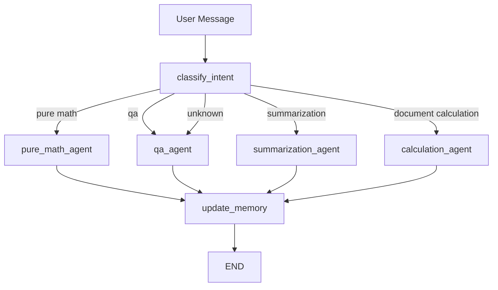

# LangGraph Document Assistant

A multi-agent document assistant built with LangGraph, LangChain, OpenAI chat models, Pydantic structured outputs, and session-aware memory. The assistant can answer questions about documents, summarize document content, and perform safe calculator-backed arithmetic over financial and healthcare document data.

## Architecture Overview

The application is organized around a LangGraph workflow that routes each user request to the correct specialized agent.

- `DocumentAssistant` in `src/assistant.py` owns session lifecycle, model configuration, tools, retrieval, and workflow invocation.
- `create_workflow` in `src/agent.py` builds the LangGraph state machine.
- `classify_intent` determines whether the request is Q&A, summarization, calculation, or unknown.
- `qa_agent`, `summarization_agent`, and `calculation_agent` perform the task-specific work.
- `update_memory` summarizes recent conversation state and tracks active document IDs.
- `SimulatedRetriever` in `src/retrieval.py` provides an in-memory document collection for testing retrieval behavior.
- `ToolLogger` in `src/tools.py` records tool usage to session-specific JSON logs.

## Workflow Graph



The same graph is also shown in the project diagram:


## State Management

The graph uses an `AgentState` typed dictionary to pass data between nodes.

Important state fields:

- `user_input`: current user message.
- `messages`: LangChain conversation messages, accumulated with LangGraph's `add_messages` reducer.
- `intent`: structured `UserIntent` object returned by intent classification.
- `next_step`: routing target selected by `classify_intent`.
- `conversation_summary`: compact memory summary generated after each turn.
- `active_documents`: document IDs relevant to the current or recent conversation.
- `current_response`: structured response payload from the active agent.
- `tools_used`: tool names called during the current turn.
- `session_id` and `user_id`: session metadata.
- `actions_taken`: node execution trace accumulated with `operator.add`.

## Structured Outputs

The assistant uses Pydantic models in `src/schemas.py` to enforce predictable outputs.

- `UserIntent`: classifies requests as `qa`, `summarization`, `calculation`, or `unknown`; confidence is constrained to `0` through `1`.
- `AnswerResponse`: Q&A output with `question`, `answer`, `sources`, `confidence`, and `timestamp`.
- `SummarizationResponse`: summary output with original length, summary text, key points, document IDs, and timestamp.
- `CalculationResponse`: calculator-oriented output with expression, string result, explanation, optional units, and timestamp.
- `UpdateMemoryResponse`: memory update with conversation summary and relevant document IDs.

Intent classification and memory updates use `llm.with_structured_output(...)`. Task agents use LangGraph's ReAct agent with `response_format=...` so final responses follow the expected schema.

## Tools

Tools are defined in `src/tools.py` and exposed to the ReAct agents.

- `calculator`: safely evaluates arithmetic expressions and returns a string result.
- `document_search`: searches documents by keyword, type, amount, amount range, or all documents.
- `document_reader`: reads the full content of a document by document ID.
- `document_statistics`: returns collection-level document counts and amount statistics.

The calculator validates expressions before evaluation. It only allows digits, whitespace, decimal points, `sqrt()`, parentheses, and basic arithmetic operators. Calls are logged whether they succeed or fail.

Pure arithmetic is detected before retrieval routing with `is_pure_math_query(...)`.
Examples such as `25 * 4`, `15% of 250000`, `100 / 5`, `sqrt(81)`, and `2 + 2` bypass document retrieval entirely and route straight to the calculator. Document-linked calculations such as `total invoice revenue`, `sum of all claims`, and `average contract value` still use metadata-aware retrieval first.

## Memory Persistence

The LangGraph workflow is compiled with `InMemorySaver`, using the active session ID as the `thread_id`. This keeps graph state available across multiple invocations in the same session.

The project also persists user-facing session artifacts:

- `sessions/<session_id>.json`: conversation history, document context, timestamps, and session metadata.
- `logs/session_<session_id>.json`: tool-call history for that session.
- `logs/assistant.log`: assistant runtime logs.

This gives the assistant both graph-level memory and inspectable filesystem history.

## Setup Instructions

### 1. Create and Activate a Virtual Environment

From the project root:

```bash
python -m venv venv
```

Windows PowerShell:

```powershell
.\venv\Scripts\Activate.ps1
```

macOS/Linux:

```bash
source venv/bin/activate
```

### 2. Install Dependencies

```bash
pip install -r requirements.txt
```

### 3. Configure Environment Variables

Create a `.env` file in the project root:

```env
OPENAI_API_KEY=your_api_key_here
```

### 4. Run the Assistant

From the `starter` directory:

```bash
python main.py
```

Useful commands inside the app:

- `/help`: show example prompts.
- `/docs`: list available sample documents.
- `/quit`: exit the assistant.

## Screenshots

The following screenshots document the assistant in action:

1. **app Initialization.jpg** - Application startup and session creation.
2. **final prompt response with updation to logs.jpg** - Final prompt response with log file updates.
3. **response to prompts with session and log files creation.jpg** - Response to prompts demonstrating session and log file generation.

All screenshots are located in the `screenshots/` folder.

## Example Conversations

### Q&A

```text
User: Who is the client in invoice INV-001?

Assistant: The client in invoice INV-001 is Acme Corporation.

Intent: qa
Sources: INV-001
Actions Taken: classify_intent, qa_agent, update_memory
```

### Summarization

```text
User: Summarize the service agreement.

Assistant: The service agreement is a 12-month contract between DocDacity Solutions Inc.
and Healthcare Partners LLC. It covers document processing platform access, 24/7
technical support, monthly analytics reports, and compliance monitoring.

Intent: summarization
Sources: CON-001
Actions Taken: classify_intent, summarization_agent, update_memory
```

### Calculation

```text
User: Calculate the sum of all invoice totals.

Assistant: I found the invoice totals, formed the expression 20000 + 69300 + 214500,
and used the calculator tool. The result is 303800.

Intent: calculation
Tools Used: document_search, document_reader, calculator
Sources: INV-001, INV-002, INV-003
Actions Taken: classify_intent, calculation_agent, update_memory
```

## Project Structure

```text
starter/
├── docs/
│   └── langgraph_agent_architecture.png
├── src/
│   ├── __init__.py
│   ├── agent.py          # LangGraph state, nodes, routing, and workflow compilation
│   ├── assistant.py      # Session orchestration and public assistant interface
│   ├── prompts.py        # Intent, Q&A, summarization, calculation, and memory prompts
│   ├── retrieval.py      # In-memory document retrieval implementation
│   ├── schemas.py        # Pydantic structured output schemas
│   └── tools.py          # LangChain tools and tool-call logging
├── .gitignore
├── main.py               # CLI entry point
└── README.md
```

Generated at runtime:

```text
project/
├── logs/
│   ├── assistant.log
│   └── session_<session_id>.json
└── sessions/
    └── <session_id>.json
```

## Technologies Used

- Python
- LangGraph
- LangChain
- LangChain OpenAI
- OpenAI chat models
- Pydantic
- python-dotenv
- print-color
- JSON session and tool-call persistence

## Validation Checklist

- Structured schemas enforce type constraints and confidence ranges.
- Intent classification routes to Q&A, summarization, or calculation nodes.
- Calculator tool validates input, logs usage, and returns string results.
- Workflow compiles with `InMemorySaver` checkpointing.
- Sessions and tool logs are automatically written to disk.
- README documents architecture, state, tools, memory, setup, examples, and screenshots.
