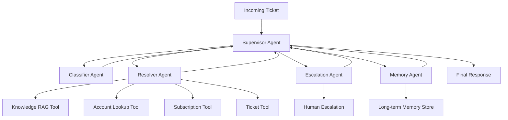

# UDA-Hub Multi-Agent Architecture Design

## Overview

UDA-Hub is a Universal Decision Agent system designed to intelligently resolve customer support tickets. It uses a **Supervisor pattern** where a central orchestrator routes incoming tickets to specialized agents based on classification and context.

## Architecture Pattern: Supervisor with Specialized Agents



## Agents

### 1. Supervisor Agent (workflow.py - supervisor_node)
- **Role**: Central orchestrator that manages the workflow
- **Responsibilities**:
  - Receives incoming tickets/messages
  - Decides which agent to route to next
  - Aggregates responses from sub-agents
  - Delivers final response to the user
- **Decision Logic**: Based on ticket classification, confidence scores, and context

### 2. Classifier Agent (agents/classifier.py)
- **Role**: Analyzes and classifies incoming tickets
- **Responsibilities**:
  - Determines ticket category (billing, technical, account, reservation, subscription, general)
  - Assesses urgency level (low, medium, high, critical)
  - Extracts key entities (user ID, account info, issue type)
- **Output**: Structured classification with category and urgency

### 3. Resolver Agent (agents/resolver.py)
- **Role**: Resolves tickets using knowledge base and tools
- **Responsibilities**:
  - Retrieves relevant knowledge base articles via RAG
  - Uses tools to look up account information
  - Manages subscriptions and processes actions
  - Provides confidence score for its resolution
- **Tools**: Knowledge RAG, Account Lookup, Subscription Management, Reservation Check

### 4. Escalation Agent (agents/escalation.py)
- **Role**: Handles cases that cannot be auto-resolved
- **Responsibilities**:
  - Summarizes the issue for human agents
  - Documents attempted resolution steps
  - Sets escalation priority (P1-P4)
  - Creates escalation tickets with full context

### 5. Memory Agent (agents/memory_agent.py)
- **Role**: Manages long-term memory for personalized support
- **Responsibilities**:
  - Retrieves past interactions for returning customers
  - Stores resolved issues and preferences
  - Provides historical context to other agents

## Tools

### Knowledge RAG Tool (tools/knowledge_tools.py)
- Searches the knowledge base using keyword-based relevance scoring
- Returns top 3 articles with confidence scores
- Falls back to escalation when no match found (threshold < 0.1)

### Account Lookup Tool (tools/account_tools.py)
- `lookup_user(email)`: Queries CultPass DB for user info
- `get_subscription_details(user_id)`: Returns subscription status/tier
- `check_user_reservations(user_id)`: Returns reservation history

### Ticket Management Tool (tools/ticket_tools.py)
- `update_ticket_status(ticket_id, new_status)`: Updates ticket state
- `log_ticket_message(ticket_id, role, content)`: Logs conversation to DB

## Information Flow

1. **Input**: User message arrives (via chat interface)
2. **Classification**: Supervisor sends to Classifier for analysis
3. **Routing Decision**: Supervisor routes based on classification:
   - Standard issues → Resolver Agent
   - Critical/unresolvable → Escalation Agent
4. **Resolution**: Resolver uses tools + knowledge base
5. **Confidence Check**: If confidence < threshold → Escalation
6. **Response**: Supervisor delivers final response

## State Management

### Short-term Memory (Session)
- Managed via LangGraph's `thread_id` configuration (MemorySaver checkpointer)
- Maintains conversation context within a session
- Stores intermediate agent decisions and tool results
- Inspectable via `orchestrator.get_state_history(config)`

### Long-term Memory (Cross-session)
- Stored in SQLite database (ticket history, messages)
- Semantic search over past interactions via Memory Agent
- Customer preferences stored as system messages in ticket history

## Decision Routing Logic

```
IF resolution_confidence == "HIGH":
    → END (deliver response)
ELIF resolution_confidence == "LOW":
    → Escalation Agent
ELIF not classified:
    → Classifier Agent
ELIF urgency == "critical":
    → Escalation Agent
ELSE:
    → Resolver Agent
```